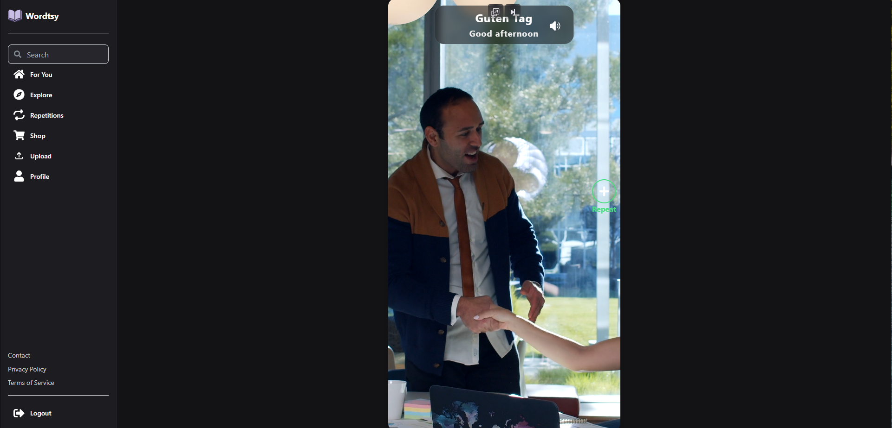
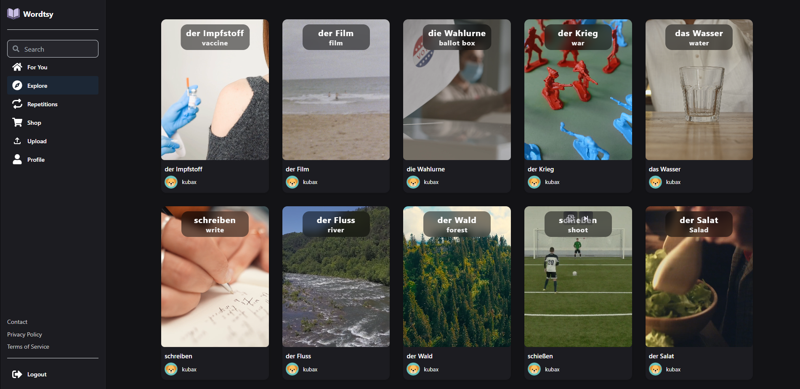
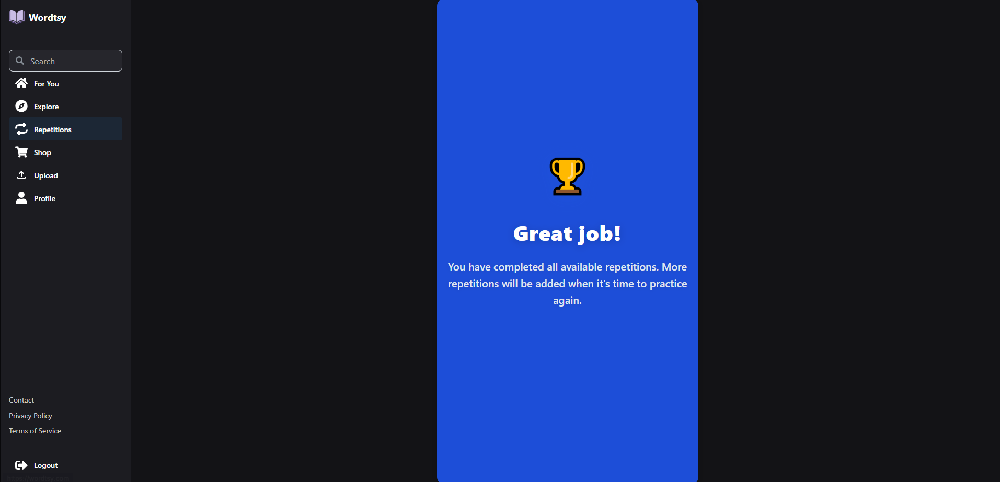
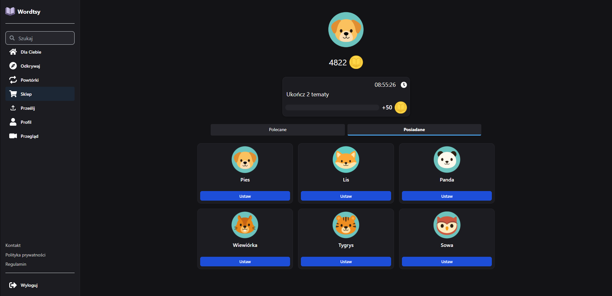
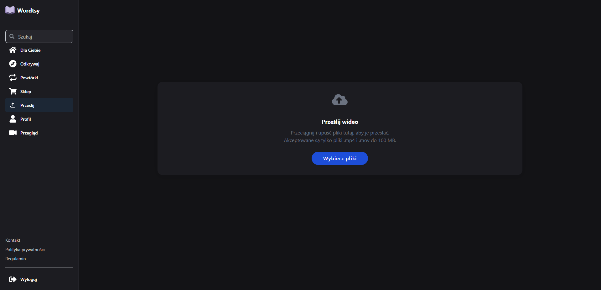
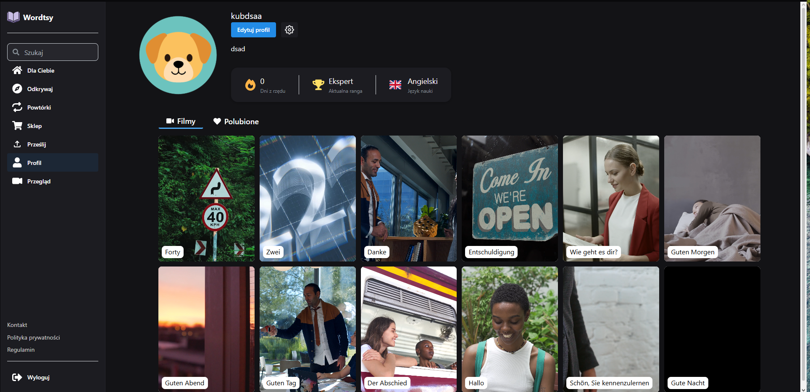

# 🚀 Wordtsy

**Wordtsy** is a modern web application designed to help users learn foreign language vocabulary through short-form video content.

Try it out
👉 https://wordtsy.com
---

## 📖 Description

Wordtsy transforms passive scrolling into active learning.

Users watch short videos ,where each clip introduces new vocabulary in context. The platform tracks progress, reinforces learning, and makes language acquisition natural and engaging.

---

## 🖼️ Screenshots

### 🏠 ForYou

### 🔍 Explore Page

### 🔁 Repetitions

### 🛒 Shop 

### ⬆️ Upload 

### 👤 Profile

---

## 🛠️ Tech Stack

### Frontend
- React
- Mantine UI

### Backend
- Node.js (Express.js)

### Infrastructure
- Cloudflare (CDN + caching)
- Render (backend hosting)
- PostgreSQL (database)

---

## ⚙️ Architecture
Client (React)  
↓  
REST API (Express)  
↓  
Database (PostgreSQL)    
↓  
Cloud Storage + CDN (Cloudflare)  
